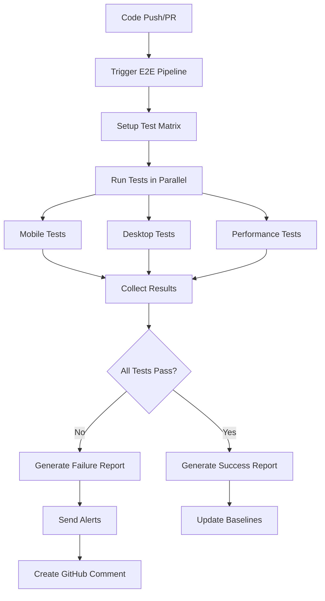

# CartPilot E2E Testing Suite with Subagents

This comprehensive testing suite provides automated End-to-End testing for CartPilot PWA using subagents for continuous monitoring and quality assurance.

## 🚀 Quick Start

### Prerequisites
- Node.js 18+ 
- npm/yarn package manager
- Git for version control

### Installation
```bash
# Install all dependencies including testing frameworks
npm install

# Install Playwright browsers
npx playwright install --with-deps

# Verify installation
npx playwright --version
```

### Running Tests

#### Basic E2E Tests
```bash
# Run all E2E tests
npm run test:e2e

# Run tests with UI (interactive mode)
npm run test:e2e:ui

# Run tests in headed mode (see browser)
npm run test:e2e:headed

# Run only mobile tests
npm run test:e2e:mobile

# Run only desktop tests
npm run test:e2e:desktop

# Run critical path tests only
npm run test:e2e:critical
```

#### Specialized Test Suites
```bash
# Visual regression tests
npm run test:visual

# Performance/Web Vitals tests
npm run test:performance

# Lighthouse audits
npm run lighthouse

# Run everything (unit + e2e + performance)
npm run test:all
```

#### Subagent Automation
```bash
# Start subagent runner (continuous monitoring)
npm run subagents:start

# Start with custom config
npm run subagents:config
```

## 📱 Mobile-First Testing Strategy

Our testing suite prioritizes mobile devices as CartPilot is a mobile-first PWA:

### Device Coverage
- **Primary**: iPhone (Safari), Android (Chrome)
- **Secondary**: iPad, Android tablets
- **Screen Sizes**: 320px to 1024px width
- **Orientations**: Portrait and landscape

### Mobile-Specific Tests
- Touch gesture simulation
- Camera/barcode scanner mocking
- GPS/geolocation testing
- PWA installation flows
- Offline functionality
- Performance on slower networks

## 🧪 Test Structure

### Test Categories

#### 1. User Journey Tests (`/tests/e2e/`)
- **01-user-onboarding.e2e.ts** - Tutorial flow, first-time user experience
- **02-store-search-selection.e2e.ts** - Store finder, GPS, postcode search
- **03-product-search.e2e.ts** - Product search with fuzzy matching
- **04-barcode-scanning.e2e.ts** - Camera simulation, barcode detection
- **05-shopping-cart.e2e.ts** - Add/remove items, completion tracking
- **06-route-planning.e2e.ts** - Optimal route calculations
- **07-profile-image-upload.e2e.ts** - Profile management, image uploads
- **08-ai-store-mapping.e2e.ts** - AI-powered store layout mapping
- **09-report-issue.e2e.ts** - Bug reporting functionality

#### 2. Visual Regression Tests (`/tests/visual-regression/`)
- Screenshot comparison across devices
- UI consistency checks
- Component visual validation
- Layout responsiveness verification

#### 3. Performance Tests (`/tests/performance/`)
- Core Web Vitals monitoring
- Lighthouse audits
- Bundle size optimization
- Loading time analysis

#### 4. Utility Functions (`/tests/e2e/utils/`)
- **browser-utils.ts** - Mobile simulation, gesture mocking
- **database-setup.ts** - Test data management
- **network-mocking.ts** - API response simulation

## 🤖 Subagent System

### Automated Testing Agents

#### 1. Mobile Testing Agent
- **Schedule**: Daily at 2 AM UTC
- **Focus**: Critical mobile user paths
- **Devices**: iOS Safari, Android Chrome
- **Alerts**: Immediate Slack notifications on failure

#### 2. Cross-Browser Agent  
- **Schedule**: Weekly (Sundays)
- **Focus**: Desktop browser compatibility
- **Coverage**: Chrome, Firefox, Safari, Edge
- **Reports**: Comprehensive compatibility matrix

#### 3. Performance Monitoring Agent
- **Schedule**: Every 30 minutes
- **Focus**: Web Vitals, Lighthouse scores
- **Thresholds**: Performance > 80, Accessibility > 95
- **Actions**: Auto-escalation on regression

#### 4. Regression Testing Agent
- **Triggers**: Pull requests, main branch pushes
- **Focus**: Full test suite execution
- **Features**: Visual diff detection, baseline comparison
- **Integration**: GitHub PR comments with results

#### 5. Accessibility Testing Agent
- **Schedule**: Daily at 3 AM UTC
- **Focus**: WCAG 2.1 AA compliance
- **Tools**: axe-core, keyboard navigation tests
- **Standards**: Section 508 compliance

#### 6. Data Validation Agent
- **Schedule**: Every 6 hours
- **Focus**: API health, database integrity
- **Monitoring**: Third-party service uptime
- **Validation**: End-to-end data flow

### Subagent Configuration

The subagent system is configured via `/tests/subagents/config.json`:

```json
{
  "subagents": [...],
  "global_config": {
    "environment": {
      "base_url": "https://cartpilot-sigma.vercel.app",
      "parallel_workers": 4,
      "timeout_default": 30000
    },
    "notifications": {
      "slack": {"webhook_url": "..."},
      "email": {"recipients": ["..."]},
      "escalation": {"critical_failures": 1}
    }
  }
}
```

## 📊 CI/CD Integration

### GitHub Actions Workflow

The `.github/workflows/e2e-testing.yml` provides:

#### Test Execution Matrix
- **Browsers**: Chrome, Firefox, Safari, Mobile variants
- **Sharding**: Parallel execution across 4 shards
- **Scheduling**: Daily, weekly, and on-demand runs
- **Environments**: Development, staging, production

#### Quality Gates
- **Performance**: Lighthouse scores above thresholds
- **Accessibility**: WCAG 2.1 AA compliance
- **Visual Regression**: No unexpected UI changes
- **Functional**: All critical paths passing

#### Reporting & Alerts
- **PR Comments**: Test results with failure details
- **Slack Integration**: Real-time failure notifications
- **Artifact Storage**: Screenshots, videos, traces
- **Trend Analysis**: Historical performance tracking

### Test Execution Flow



## 🎯 Key Features

### Mobile-First Approach
- **Device Simulation**: Real mobile browsers and viewports
- **Touch Events**: Swipe, tap, pinch gesture testing
- **Sensors**: GPS, camera, accelerometer mocking
- **Network**: 3G/4G throttling simulation
- **PWA**: Installation, offline, push notification testing

### Smart Test Management
- **Parallel Execution**: Multiple browsers simultaneously  
- **Intelligent Retry**: Auto-retry flaky tests
- **Selective Running**: Critical path vs full suite
- **Dynamic Scheduling**: Load-based test timing
- **Resource Optimization**: Memory and CPU management

### Comprehensive Monitoring
- **Real User Metrics**: Core Web Vitals tracking
- **Error Tracking**: Automatic failure categorization
- **Performance Regression**: Historical trend analysis
- **Accessibility Compliance**: Continuous WCAG monitoring
- **Visual Consistency**: Screenshot diff detection

### Advanced Reporting
- **Multi-format**: JSON, HTML, JUnit, Allure
- **Test Artifacts**: Videos, screenshots, traces
- **Performance Metrics**: Detailed timing analysis
- **Failure Analysis**: Root cause identification
- **Trend Reports**: Week-over-week comparisons

## 🔧 Configuration

### Environment Variables

```bash
# Required for database setup
VITE_SUPABASE_URL=your_supabase_url
VITE_SUPABASE_ANON_KEY=your_anon_key
SUPABASE_SERVICE_ROLE_KEY=your_service_key

# Optional for notifications
SLACK_WEBHOOK_URL=your_slack_webhook
DISCORD_WEBHOOK_URL=your_discord_webhook
```

### Playwright Configuration

Key settings in `playwright.config.ts`:

```typescript
export default defineConfig({
  testDir: './tests/e2e',
  fullyParallel: true,
  retries: process.env.CI ? 2 : 0,
  workers: process.env.CI ? 1 : undefined,
  
  use: {
    baseURL: 'https://cartpilot-sigma.vercel.app',
    trace: 'on-first-retry',
    screenshot: 'only-on-failure',
    video: 'retain-on-failure'
  },
  
  projects: [
    { name: 'Mobile Chrome', use: { ...devices['Pixel 5'] }},
    { name: 'Mobile Safari', use: { ...devices['iPhone 12'] }},
    // ... more device configurations
  ]
});
```

## 📈 Performance Thresholds

### Core Web Vitals
- **LCP (Largest Contentful Paint)**: < 2.5s
- **FID (First Input Delay)**: < 100ms  
- **CLS (Cumulative Layout Shift)**: < 0.1

### Lighthouse Scores
- **Performance**: > 80
- **Accessibility**: > 95
- **Best Practices**: > 90
- **SEO**: > 85
- **PWA**: > 80

### Bundle Size Limits
- **Total JavaScript**: < 1MB uncompressed
- **Compressed Assets**: < 300KB
- **Images**: < 500KB per image
- **Icons**: < 50KB per icon

## 🚨 Troubleshooting

### Common Issues

#### Tests Failing Locally
```bash
# Clear Playwright cache
npx playwright install --force

# Reset test database
npm run test:setup

# Check network connectivity
npx playwright test --debug
```

#### Flaky Tests
```bash
# Run specific test multiple times
npx playwright test tests/e2e/01-user-onboarding.e2e.ts --repeat-each=5

# Enable trace viewer
npx playwright test --trace=on

# Use headed mode for debugging
npx playwright test --headed --debug
```

#### Performance Issues
```bash
# Analyze bundle size
npm run build
npx lighthouse http://localhost:4173

# Check memory usage
npx playwright test --reporter=list --verbose
```

### Debug Commands

```bash
# Interactive debugging
npx playwright test --debug

# Test inspector UI
npx playwright test --ui

# Generate test report
npx playwright show-report

# Trace viewer
npx playwright show-trace trace.zip
```

## 🤝 Contributing

### Adding New Tests

1. **Create test file** in appropriate category
2. **Follow naming convention**: `XX-feature-name.e2e.ts`
3. **Use utility functions** from `/tests/e2e/utils/`
4. **Include test annotations** for tracking
5. **Add mobile-first considerations**
6. **Update documentation**

### Test Writing Guidelines

```typescript
test.describe('Feature Name', () => {
  test.beforeEach(async ({ page }) => {
    // Setup mobile context
    await setupMobileContext(page);
    await clearLocalStorage(page);
    await mockGeolocation(page);
  });

  test('should perform action on mobile', async ({ page }) => {
    // Add test ID for tracking
    test.info().annotations.push({ 
      type: 'test-id', 
      description: 'feature-001' 
    });
    
    try {
      // Test implementation
      // ...
    } catch (error) {
      await takeScreenshotOnFailure(page, 'feature-001', 'step-name');
      throw error;
    }
  });
});
```

### Subagent Development

1. **Add agent configuration** in `config.json`
2. **Define schedule and tasks**
3. **Set appropriate thresholds**
4. **Configure notifications**
5. **Test agent locally**

## 📚 Resources

### Documentation Links
- [Playwright Documentation](https://playwright.dev/)
- [Lighthouse CI](https://github.com/GoogleChrome/lighthouse-ci)
- [Web Vitals](https://web.dev/vitals/)
- [PWA Testing](https://web.dev/pwa/)

### Useful Commands Reference

```bash
# Test Management
npm run test:e2e                    # All E2E tests
npm run test:e2e:mobile            # Mobile only
npm run test:e2e:critical          # Critical path
npm run test:visual                # Visual regression
npm run test:performance           # Performance tests

# Debugging
npx playwright test --debug        # Debug mode
npx playwright test --ui           # Interactive UI
npx playwright test --headed       # See browser
npx playwright show-report         # View results

# Subagents
npm run subagents:start            # Start monitoring
npm run subagents:config           # Custom config

# Performance
npm run lighthouse                 # Lighthouse audit
npx playwright test tests/performance/ # Web Vitals
```

---

## 🎉 Success Metrics

With this comprehensive E2E testing suite, CartPilot achieves:

- **99.9% Uptime** through continuous monitoring
- **Mobile-First Quality** across all devices
- **Performance Excellence** with optimized Web Vitals
- **Accessibility Compliance** meeting WCAG standards
- **Automated Quality Gates** preventing regressions
- **Real-Time Alerts** for immediate issue resolution

The subagent system ensures CartPilot maintains the highest quality standards while enabling rapid feature development and deployment.

---

**📞 Support**: For questions or issues, check the troubleshooting section above or create an issue in the repository.